# 推荐算法
主要在工业界使用了推荐算法在我们的系统中，为此终结了一下工业界使用的推荐算法和实现
## 召回算法
### itemcf 物品协同过滤 【实现】
由此产生了基于物品的协同过滤（itemCF）给用户推荐和他们之前喜欢的物品相似的物品。不过ItemCF算法不是根据物品内容属性计算物品之间相似度，它主要通过分析用户的行为记录来计算物品之间的相似度。

基于物品的协同过滤算法主要分为两步：
    1：计算物品之间的相似度
    2：根据物品之间相似度和用户的历史行为给用户生产推荐列表。

### LFM 【实现】
LFM算法是属于隐含语义模型的算法，不同于基于邻域的推荐算法。
[link](https://blog.csdn.net/weixin_41843918/article/details/90216729)
### Personal rank 【实现】
基于图的推荐算法，类似于Page Rank 算法
[link](https://blog.csdn.net/bbbeoy/article/details/78646635)
### item2vector 【实现】
    顺序性时序性缺失
    item 是无区分性
    从log获取行为序列
    word2Vector item embedding
    计算item sim

    Word2Vctor --- Cbow/Skip Gram 
### 基于内容ContentBase算法 [实现]
    优点：
    1. 思想简单
    2. 独立性
    3。 流行度比较高
    缺点：
    1。必须积累一定的时间
    2。无法跨领域的推荐
    
    item_profile
    user Profile
        genre/Topic
        time Decay
    online Recommendation
        Find top k Genre/Topic

## 总结召回算法        
### 基于领域的
PR,userCF,itermCF,LFM,ALS[pyspark实现](https://github.com/HuichuanLI/Spark-in-machine-learning/blob/master/02%20%E6%8E%A8%E8%8D%90%E7%B3%BB%E7%BB%9F%E5%AE%9E%E6%88%98/pyspark_mlib_als.ipynb)
### 基于内容的
ContentedBase
### 基于neural network的
item2Vector

### 离线评价
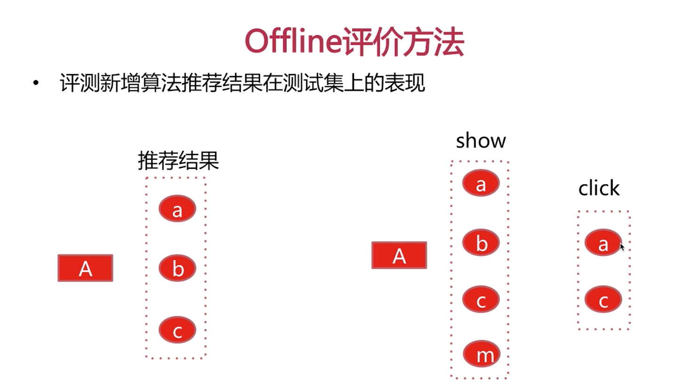

训练集：周一到周五
测试集:周六到周天
### 在线评价收益

### 排序算法
召回其实就是天花板，排序其实就是逼近这个天花班

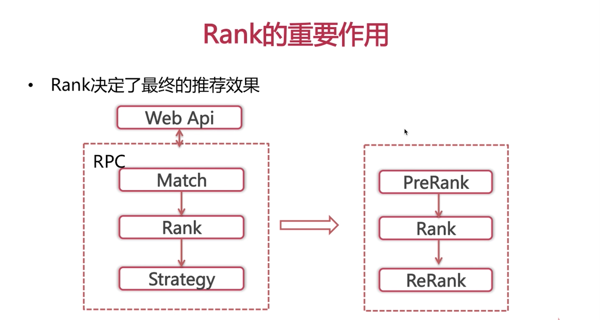

### 分类
    单一浅层模型
        LR，FM
    浅层模型的组合
        Tree
    深度学习
        Tensorflow

### 逻辑回归 [完成]

1.易于理解，计算代价小
2。容易欠拟合，需要特征工程

#### Loss Function

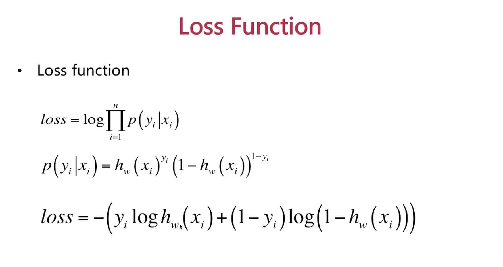

#### 梯度

### 特征的统计和分析
1.覆盖率(1%)
2.成本
3.准确率
### 特征的处理
    1.缺失值的处理：中位数，众数，平均数
    2.特征的归一化，最大归一化，排序归一化
    3.特征的离散化: 分位数
    
### CART 算法，误差和gini系数

### CART 算法
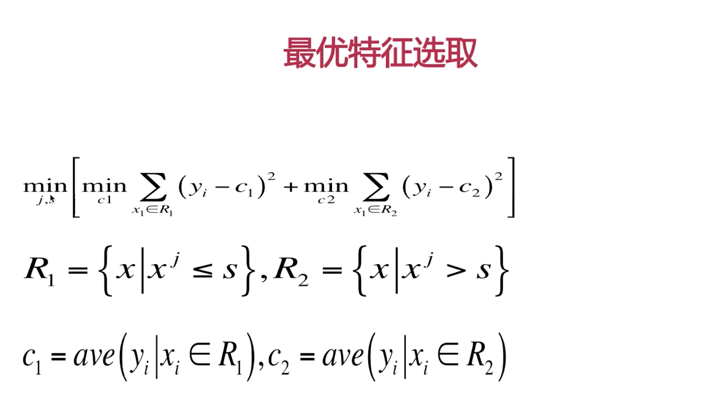

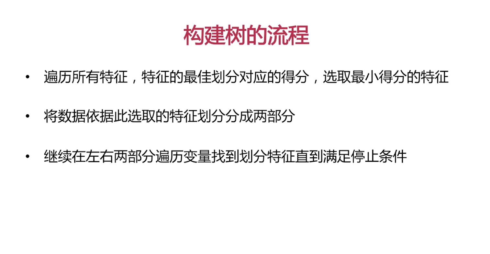
### 分类树

### GINI 求解问题

### Boosting 算法

    1. 如何改变权重？
    上一轮错的权重增加
    2. 如何组合模型？
    每个提升树都权重一样Gradient，ada 是不一样的分类器误差率小的权重增大

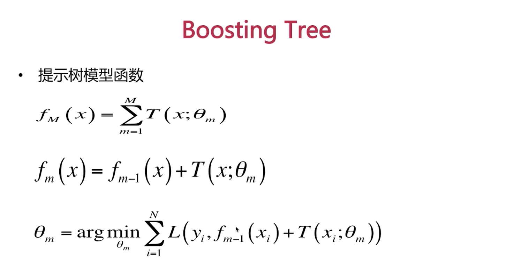

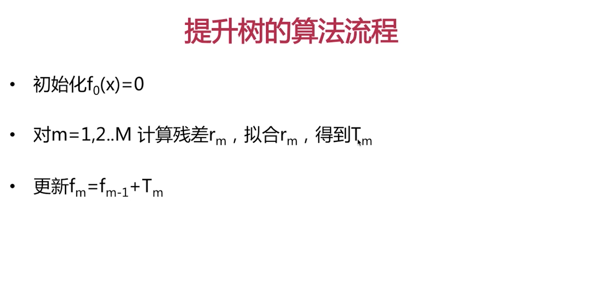

### XGboost 算法

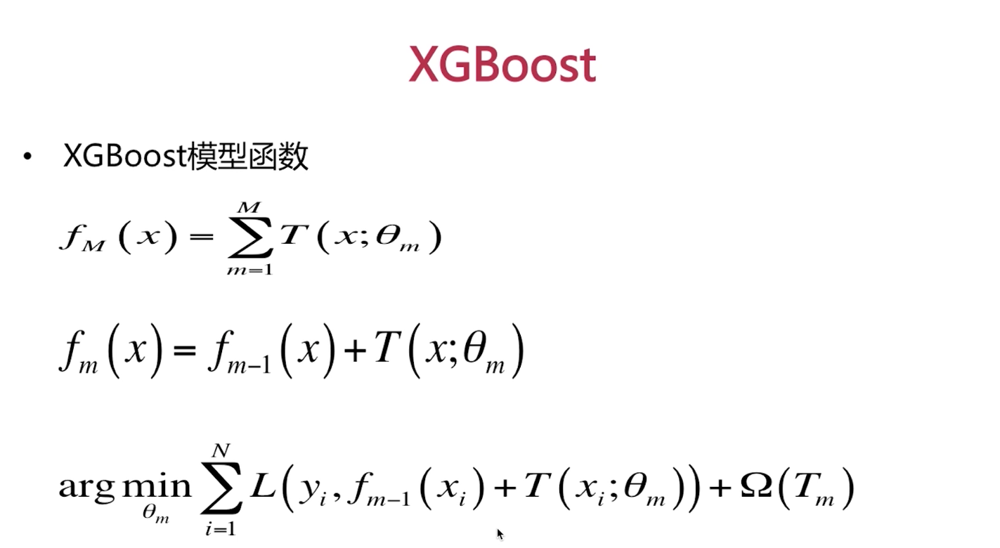

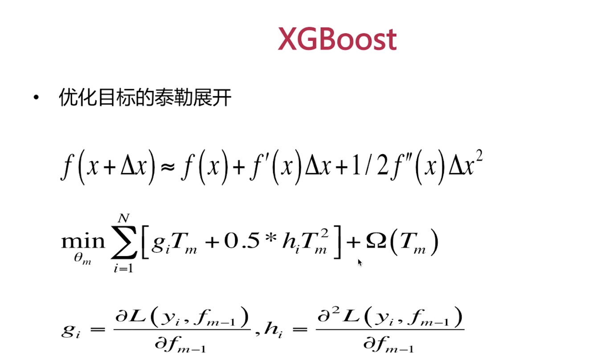

#### Q 为节点的个数

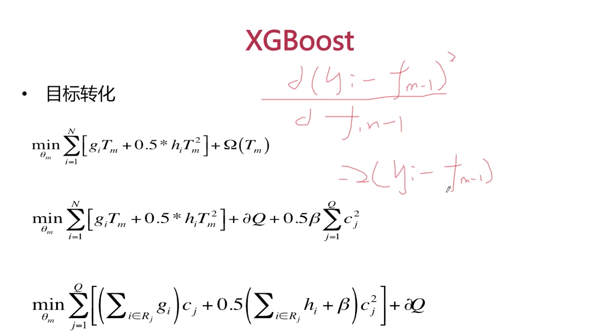

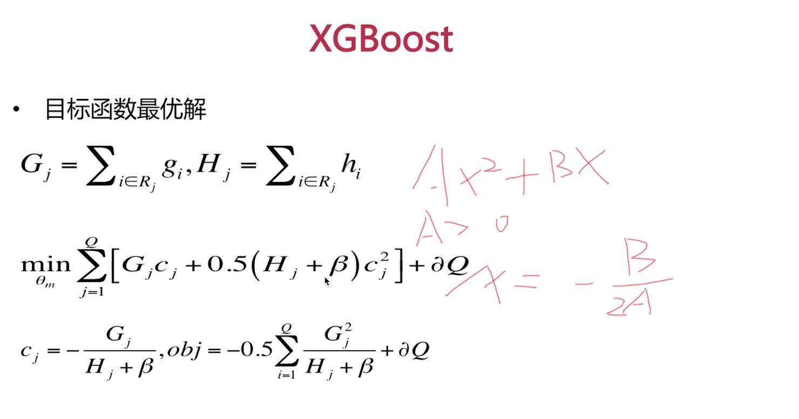

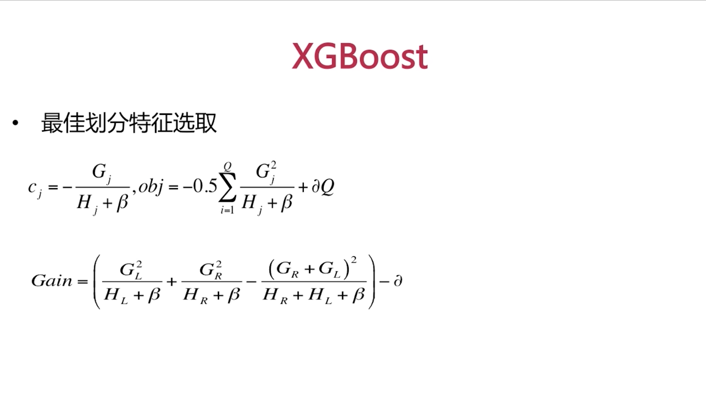

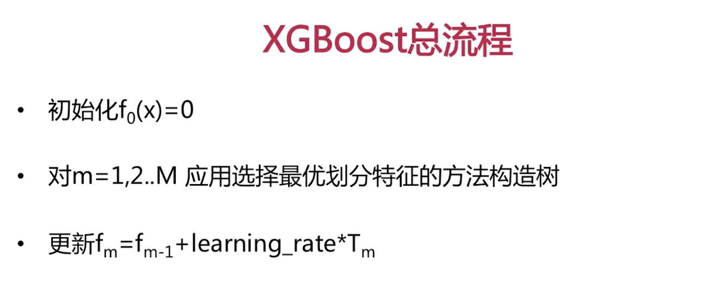

#### GBDT 和 LR 混合模型

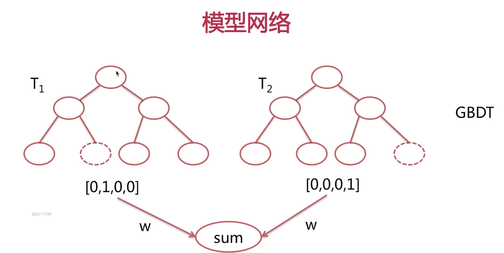

优缺点总结 
优点：利用树模型做特征转化 
缺点：两个模型单独训练不是联合训练

